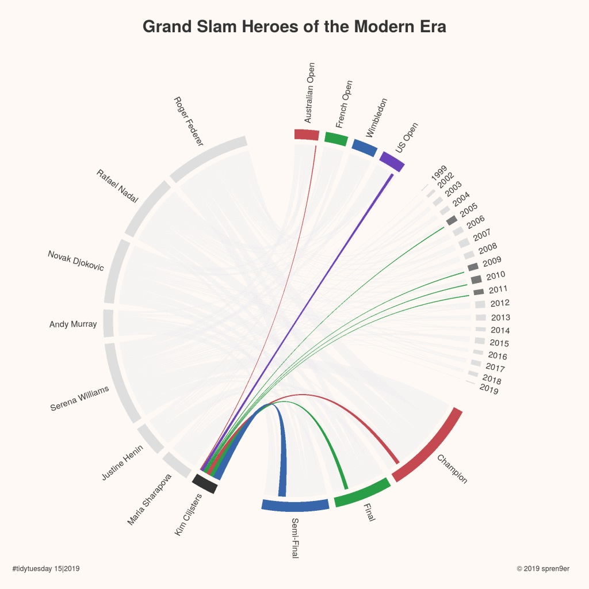
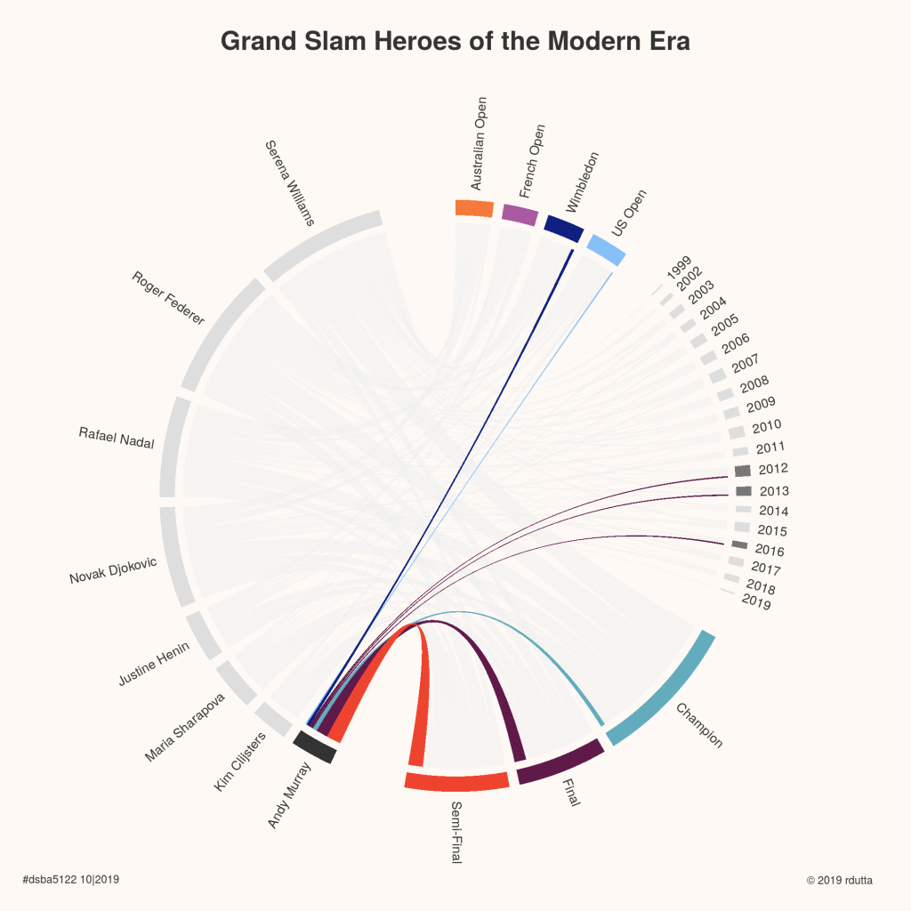
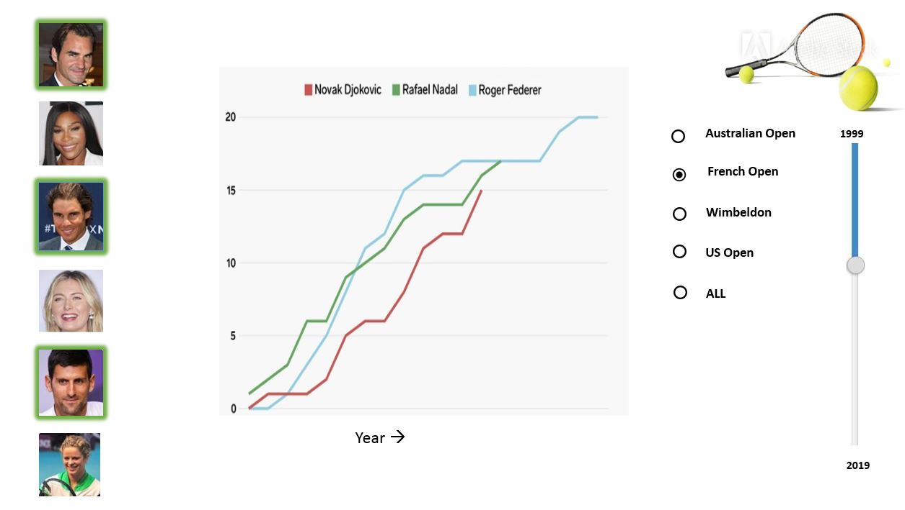

```{r setup, include=FALSE}
library(flexdashboard)
```
# INTRODUCTION
<br><br><br><br><br><br>
<P allign=center><B><H1>Design Contest - Tennis GrandSlam Data</H1></B>
<br>Dated: 10/27/2019<br>
<br><br><br><br><br><br><br><br><br><br></p>

<font size="+2">
<p align=right>-Presented by<br>
<i>Roma Dutta</i><br>
<i>Ganesh Viswanathan</i><br>
GitHub-https://github.com/ganesh2512/DSBA/tree/master/designContest_Ganesh_Roma
<br>
TidyTuesday#-spren9er
RStudioLink-https://rstudio.cloud/project/642289</p>

</font>
```{r  out.width = "100%", out.height = "100%"}


```
***
# RESEARCH
### <b>Grand Slam results from 1968-2019 of some of the best female and male tennis players in modern era.</b>
<table border="0" style="width:90%" align="center">
<tr>
<td width = 45%>
<table style="border: 5px solid #1C6EA4"><tr><td>
```{r  out.width = "100%", out.height = "60%"}


```
</td></tr></table>
</td>
<td width = 55%>
<table border="0" width="80%" cellpadding="4" align="right">
<tr><td> - <strong style="font-size: 15px"> Data source -Tidy Tuesday https://github.com/rfordatascience/tidytuesday/tree/master/data/2019/2019-04-09
<br><br><br>
- Code Source: Dr. Torsten Sprenger's tidytusday post on Apr 9 https://github.com/spren9er/tidytuesday
https://github.com/spren9er/tidytuesday/blob/master/tidytuesday_201915_tennis_grand_slams.r <br><br>
<br><br><br><br><br><br><br><br><br><br><br><br><br><br><br><br><br><br><br><br><br><br></strong>
</td>
</tr>
</table>
</td>
</tr>
</table>

***


# CRITICAL REVIEW
### <b>Overall The graph looks awesome -<i>But</i></b>
#### The graph provides lot of data within a single view. Its has details on winners with names along with the type of tourney and year. And is well presented.
### <b>1-Color Repeated</b>
#### The color used for grandslam types and place in tourney are repeated and hence confusing the view
### <b>2-Color blind Issue</b>
#### Color blind scheme could be used to make it easier for people with disabilities.
### <b>3-Comparison by year across players not possible</b>
#### Comparison of how a player progressed on grandslam with his age compared to others is not possible to figure out
### <b>4-Arrangement of folks</b>
#### Arrange of folks looks a little complex. Could have been better arranged as a bar with multiple axes.
### <b>5-Year could be in ascending order</b>
#### The year comparison of when the player won more grandslams is not possible as arrangement is in chronological order
```{r  out.width = "100%", out.height = "100%"}


```
***


# IMPROVISATION
####
<table border="0" style="width:90%" align="center">
<tr>
<td width = 45%>
<table style="border: 5px solid #1C6EA4"><tr><td>
```{r  out.width = "100%", out.height = "60%"}


```
</td></tr></table>
</td>
<td width = 55%>
<table border="0" width="80%" cellpadding="4" align="center">
<tr><td> - <strong style="font-size: 15px"> Different color options have been  used for "Tournament" and "Tournament Outcome" to better comprehend<br><br>
- We have applied Bang wong and Zesty color palettes that takes care of color blidness <br><br>
- We have arranged the players by total number of wins
<br><br><br><br><br><br><br><br><br><br><br><br><br><br><br><br><br><br><br><br><br><br></strong>
</td>
</tr>
</table>
</td>
</tr>
</table>

***
# PROPOSED DESIGN
<table width=90% align="center" style="border: 7px solid #1C6EA4"><tr><td>
```{r  out.width = "100%", out.height = "90%"}


```
</td></tr></table>
***
# NEW IDEAS


##
```{r  out.width = "50%", out.height = "50%", warning=FALSE, echo=FALSE}
library(tidyverse)
library(scales)

# Import data
player_dob <- readr::read_csv("https://raw.githubusercontent.com/rfordatascience/tidytuesday/master/data/2019/2019-04-09/player_dob.csv")
grand_slams <- readr::read_csv("https://raw.githubusercontent.com/rfordatascience/tidytuesday/master/data/2019/2019-04-09/grand_slams.csv")
grand_slam_timeline <- readr::read_csv("https://raw.githubusercontent.com/rfordatascience/tidytuesday/master/data/2019/2019-04-09/grand_slam_timeline.csv")

# Add a case statement for court types
grand_slams <-
  grand_slams %>%
  mutate(court_type = case_when(grand_slam == "australian_open" ~ "Hard Court",
                              grand_slam == "us_open" ~ "Hard Court",
                              grand_slam == "french_open" ~ "Clay Court",
                              grand_slam == "wimbledon" ~ "Grass Court"))

# Set theme for charts
#theme_set(theme_classic())

# Plot Top Ten Winners
grand_slams %>%
count(name, court_type, sort = TRUE) %>%
add_count(name, wt = n) %>%
filter(n >=5) %>%
mutate(name = fct_reorder(name, n, sum)) %>%
ggplot(aes(name, n, fill = court_type)) +
geom_col() +
scale_fill_manual(values = c('#F6BD60', '#7FB069', '#548687')) +
coord_flip() +
labs(x = "",
     y = "No. of Grand Slam Wins",
     title = "Top Grand Slam Winners By Court Type",
     subtitle = "1968 - 2019") +
theme(legend.position="top",
      legend.title = element_blank(),
      legend.spacing.x = unit(0.2, 'cm'),
      plot.title=element_text(size=12,face="bold"),
      plot.subtitle=element_text(face="italic",size=11,colour="grey40"))

aspect_ratio <- 2
ggsave("top_players_court.png", height = 5 , width = 5 * aspect_ratio)

```
##
```{r out.width = "50%", out.height = "50%",}
library(tidyverse)
library(scales)

# Import data
player_dob <- readr::read_csv("https://raw.githubusercontent.com/rfordatascience/tidytuesday/master/data/2019/2019-04-09/player_dob.csv")
grand_slams <- readr::read_csv("https://raw.githubusercontent.com/rfordatascience/tidytuesday/master/data/2019/2019-04-09/grand_slams.csv")
grand_slam_timeline <- readr::read_csv("https://raw.githubusercontent.com/rfordatascience/tidytuesday/master/data/2019/2019-04-09/grand_slam_timeline.csv")
# Calculate age
# Add a case statement for court types
grand_slams <-
  grand_slams %>%
  mutate(court_type = case_when(grand_slam == "australian_open" ~ "Hard Court",
                              grand_slam == "us_open" ~ "Hard Court",
                              grand_slam == "french_open" ~ "Clay Court",
                              grand_slam == "wimbledon" ~ "Grass Court"))

age <-
  player_dob %>%
  select(name, date_of_birth) %>%
  inner_join(grand_slams, by = "name") %>%
  mutate(age = as.numeric(difftime(tournament_date, date_of_birth, unit = "days"))/365)

# Boxplot of player ages by tournament
age %>%
  mutate(grand_slam = str_to_title(str_replace(grand_slam, "_", " "))) %>%
  ggplot(aes(grand_slam, age, fill = gender)) +
  geom_boxplot() +
  scale_fill_manual(values = c('#8700F9', '#00C4AA')) +
  labs(x = "Grand Slam",
       y = "Age",
       title = "Distribution of Age By Grand Slam") +
  theme(legend.position="top",
        legend.title = element_blank(),
        legend.spacing.x = unit(0.2, 'cm'),
        plot.title=element_text(size=12,face="bold"))

aspect_ratio <- 2
ggsave("images/grand_slams_age_distribution.png", height = 5 , width = 5 * aspect_ratio)

```
<br>
Courtesy: https://jaredbraggins.com/2019/04/grand-slam-winners/